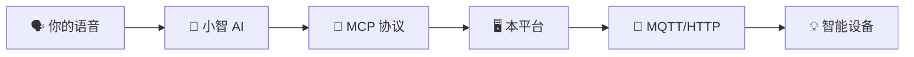

<p align="center">
  <h1 align="center">🤖 小智 MCP-MQTT 管理平台</h1>
  <p align="center">
    <em>让 AI 听懂你的话，控制你的智能设备</em>
  </p>
  <p align="center">
    
    
    
    
    
  </p>
</p>

---

## 📖 这是什么？

想象一下：你对小智说一句"帮我把卧室灯打开"，灯就真的亮了。

这不是魔法，而是 **MCP-MQTT 管理平台** 做的事情。它是一座桥梁，连接了 AI 大模型和你家里的智能设备。

**核心思路**：你说的话 → 小智 AI 理解 → 通过 MQTT 告诉设备 → 设备执行



---

## ✨ 为什么选它？

| 特性 | 说明 |
|------|------|
| 🗣️ **说人话就行** | 不用写代码，直接用自然语言控制设备 |
| 🔄 **双向沟通** | 不仅能控制，还能查询设备状态（比如"现在室温多少？"）|
| 🔌 **多协议支持** | MQTT、HTTP 都能用，兼容主流智能家居生态 |
| 🏠 **多项目隔离** | 一个账号管理多个空间，互不干扰 |
| 📊 **实时日志** | 每一步操作都看得见，出问题一目了然 |

---

## 🚀 三分钟快速上手

### 方式一：Docker 一键部署（推荐）

```bash
# 1. 克隆代码
git clone https://gitee.com/T510/ai-xiaozhi-mcp.git
cd ai-xiaozhi-mcp

# 2. 启动
docker compose up -d

# 3. 初始化数据库
docker exec xiaozhi-app python init_db.py

# 4. 打开浏览器访问
# http://localhost:8000
```

就这么简单！

### 方式二：Ubuntu 一键脚本

```bash
curl -fsSL https://gitee.com/T510/ai-xiaozhi-mcp/raw/master/install.sh | bash
```

脚本会自动搞定一切，安装完成后会告诉你访问地址和初始密码。

### 方式三：源码部署（开发者）

```bash
git clone https://gitee.com/T510/ai-xiaozhi-mcp.git
cd ai-xiaozhi-mcp
python -m venv venv
source venv/bin/activate
pip install -r requirements.txt -i https://pypi.tuna.tsinghua.edu.cn/simple
cp .env.example .env  # 编辑 .env 填入数据库配置
python init_db.py
python run.py
```

### 方式四：1Panel 面板部署

如果你的服务器装了 [1Panel](https://1panel.cn)，可以通过面板的 Docker 编排功能部署。

**第一步：SSH 登录服务器，克隆代码**

```bash
cd /opt
git clone https://gitee.com/T510/ai-xiaozhi-mcp.git
cd ai-xiaozhi-mcp
```

**第二步：修改配置（可选）**

编辑 `docker-compose.yml`，修改数据库密码和 JWT 密钥：

```yaml
# MySQL 密码（两个地方要保持一致）
MYSQL_ROOT_PASSWORD: 你的安全密码
DATABASE_URL: mysql+pymysql://root:你的安全密码@db:3306/xiaozhi_mcp

# JWT 密钥
SECRET_KEY: 随便写一个复杂字符串
```

**第三步：在 1Panel 中创建编排**

1. 登录 1Panel 面板
2. 左侧菜单 → **容器** → **编排**
3. 点击 **创建编排**
4. 名称填 `xiaozhi-mcp`
5. 选择 **从服务器路径加载**
6. 路径填 `/opt/ai-xiaozhi-mcp/docker-compose.yml`
7. 点击 **确认**

**第四步：初始化数据库**

在 1Panel 的 **终端** 或 SSH 中执行：

```bash
docker exec xiaozhi-app python init_db.py
```

**第五步：访问**

打开浏览器访问 `http://你的服务器IP:8000`

**后续更新代码：**

1. SSH 登录服务器执行 `cd /opt/ai-xiaozhi-mcp && git pull`
2. 在 1Panel **编排** 页面点击 `xiaozhi-mcp` 的 **重建** 按钮

---

## 🔒 HTTPS / 反向代理配置

**为什么生产环境需要 HTTPS？**

- **登录凭据不裸奔**：本平台用 JWT 登录，HTTP 明文传输时账号密码和 Token 会被中间人轻松窃听
- **浏览器安全特性受限**：HTTP 下无法使用剪贴板、地理定位、Service Worker、Secure Cookie 等能力
- **MCP / WebSocket 安全**：小智 MCP 接入点通常是 `wss://`（加密），混合内容会被浏览器拦截
- **合规与信任**：HTTPS + 小绿锁是用户识别"正规服务"的最直接信号，Let's Encrypt 证书完全免费

生产环境建议：**反向代理统一接管 80/443 → 转发到容器 8000 端口**，由反代负责 TLS 终止、证书续期、限流。

### 方案 A：Caddy（推荐，自动 HTTPS）

Caddy 会自动向 Let's Encrypt 申请并续期证书，零配置即可上 HTTPS。

`Caddyfile` 示例（把 `mcp.yourdomain.com` 换成你的域名）：

```caddyfile
mcp.yourdomain.com {
    # 反向代理到本平台的 8000 端口
    reverse_proxy localhost:8000

    # 压缩与超时（可选）
    encode zstd gzip
    handle_errors {
        respond "服务异常，请稍后重试" 502
    }
}
```

启动：

```bash
# 1. 安装 Caddy（Ubuntu/Debian）
sudo apt install -y caddy

# 2. 把上面的 Caddyfile 放到 /etc/caddy/Caddyfile
sudo cp Caddyfile /etc/caddy/Caddyfile

# 3. 重启 Caddy，它会自动申请证书并启用 HTTPS
sudo systemctl restart caddy

# 4. 防火墙放行 80/443
sudo ufw allow 80,443/tcp
```

> ✅ Caddy 启动后会自动把 80 跳转到 443，证书到期前自动续期，无需任何 cron。

### 方案 B：Nginx + Let's Encrypt（certbot）

适合已有 Nginx 站点、需要精细控制路由的部署。

**第一步：安装 Nginx 和 certbot**

```bash
sudo apt update
sudo apt install -y nginx certbot python3-certbot-nginx
```

**第二步：配置 Nginx 反代**

新建 `/etc/nginx/sites-available/xiaozhi-mcp`：

```nginx
server {
    listen 80;
    server_name mcp.yourdomain.com;  # 换成你的域名

    # 上传体积限制（按需调整）
    client_max_body_size 16m;

    location / {
        proxy_pass http://127.0.0.1:8000;
        proxy_set_header Host $host;
        proxy_set_header X-Real-IP $remote_addr;
        proxy_set_header X-Forwarded-For $proxy_add_x_forwarded_for;
        proxy_set_header X-Forwarded-Proto $scheme;

        # WebSocket 支持（实时日志、MCP 接入需要）
        proxy_http_version 1.1;
        proxy_set_header Upgrade $http_upgrade;
        proxy_set_header Connection "upgrade";

        # 超时设置（长连接场景）
        proxy_read_timeout 86400s;
        proxy_send_timeout 86400s;
    }
}
```

启用站点并申请证书：

```bash
# 1. 软链启用站点
sudo ln -s /etc/nginx/sites-available/xiaozhi-mcp /etc/nginx/sites-enabled/
sudo nginx -t && sudo systemctl reload nginx

# 2. 申请 Let's Encrypt 证书（会自动改写 Nginx 配置加 TLS）
sudo certbot --nginx -d mcp.yourdomain.com

# 3. 测试自动续期
sudo certbot renew --dry-run
```

> ✅ certbot 默认会安装 systemd timer 自动续期，无需手动维护。

### 反代之后还需要做什么？

1. **docker-compose.yml 不用动**：app 仍监听 8000，反代负责对外 443
2. **CORS_ORIGINS 改成你的域名**：把 `CORS_ORIGINS: "*"` 改为 `CORS.yourdomain.com,https://mcp.yourdomain.com`
3. **MCP_ALLOW_INSECURE 保持 `false`**：反代已提供 HTTPS，应用层不需要降级到不安全模式
4. **如需仅本地访问 8000**：把 `ports: - "8000:8000"` 改为 `ports: - "127.0.0.1:8000:8000"`，外网只能走 443

---

## 📋 使用指南

### 1️⃣ 注册登录

打开浏览器，访问你的部署地址，注册一个账号。

### 2️⃣ 创建项目

进入工作台，点击「新建项目」，填写：
- **项目名称**：随便起，比如"我的卧室"
- **MCP 接入点**：去 [小智开发者控制台](https://xiaozhi.me) 找到你的智能体，复制 WebSocket 地址
- **MQTT 配置**：填入你的 MQTT Broker 地址、端口、用户名和密码

### 3️⃣ 添加设备工具

切换到「工具管理」，添加你要控制的设备：

| 工具类型 | 用途 | 例子 |
|----------|------|------|
| MQTT 发送 | 控制设备 | 开灯、关空调 |
| MQTT 读取 | 查询状态 | 温度、湿度 |
| HTTP 调用 | 对接其他系统 | Home Assistant |

**配置小贴士**：
- 「工具标识」用英文，比如 `control_light`
- 「功能描述」要写清楚人话，AI 靠这个理解你想干嘛，比如"控制卧室灯光的开关"

### 4️⃣ 启动测试

在项目页面点击「启动」，切换到「实时日志」看看有没有显示「MCP WebSocket 连接成功」。成功了就对着小智说句话试试！

---

## 💬 交互示例

```
你：小智，帮我把卧室的灯打开
小智：好的，卧室灯已打开。
    ↓
（后台：control_light 工具被触发 → MQTT 发送 "on" → 灯亮了）
```

---

## 🛠️ 常见问题

<details>
<summary><b>❌ 启动报 ModuleNotFoundError</b></summary>

Python 环境没激活或者依赖没装全。确保激活了虚拟环境，然后：
```bash
pip install -r requirements.txt
```
</details>

<details>
<summary><b>❌ 连不上 MySQL 数据库</b></summary>

检查这几项：
1. MySQL 服务有没有启动？
2. `.env` 文件里的数据库用户名、密码、端口对不对？
3. 数据库 `xiaozhi_mcp` 有没有创建？
</details>

<details>
<summary><b>❌ 连接成功了但小智没反应</b></summary>

大概率是「工具描述」写得不清楚。AI 靠描述来理解意图，写得越清楚越好。比如：
- ❌ "灯"（太模糊）
- ✅ "控制卧室主灯的开关，on=开灯，off=关灯"
</details>

<details>
<summary><b>❌ 想改端口号</b></summary>

- 源码部署：编辑 `run.py`，改 `port=8000` 里的数字
- Docker 部署：编辑 `docker-compose.yml`，改 `ports: - "8000:8000"` 前面的数字
</details>

<details>
<summary><b>🔄 Docker 部署后代码怎么更新？</b></summary>

```bash
# 1. 进入项目目录
cd ~/ai-xiaozhi-mcp

# 2. 拉取最新代码
git pull

# 3. 重新构建并重启（会自动停旧容器、构建新镜像、启动新容器）
docker compose up -d --build

# 4. 如果数据库表结构有变化，需要重新初始化
docker exec xiaozhi-app python init_db.py
```

> ⚠️ `docker compose up -d --build` 只会重建应用容器，MySQL 数据容器不受影响。
</details>

---

## 📡 API 接口

提供标准 RESTful API，方便集成：

### 认证
| 方法 | 路径 | 说明 |
|------|------|------|
| POST | `/api/auth/register` | 注册 |
| POST | `/api/auth/login` | 登录 |
| GET | `/api/auth/me` | 获取当前用户 |

### 项目管理
| 方法 | 路径 | 说明 |
|------|------|------|
| GET | `/api/projects` | 项目列表 |
| POST | `/api/projects` | 创建项目 |
| PUT | `/api/projects/{id}` | 更新项目 |
| DELETE | `/api/projects/{id}` | 删除项目 |
| POST | `/api/projects/{id}/start` | 启动连接 |
| POST | `/api/projects/{id}/stop` | 停止连接 |
| WS | `/api/projects/{id}/logs` | 实时日志 |

### 工具管理
| 方法 | 路径 | 说明 |
|------|------|------|
| GET | `/api/projects/{id}/tools` | 工具列表 |
| POST | `/api/projects/{id}/tools` | 添加工具 |
| PUT | `/api/projects/{id}/tools/{id}` | 更新工具 |
| DELETE | `/api/projects/{id}/tools/{id}` | 删除工具 |

---

## 📁 项目结构

```
ai-xiaozhi-mcp/
├── app/                    # 核心代码
│   ├── routers/            # API 路由
│   ├── services/           # 业务逻辑（MQTT、MCP、日志）
│   ├── models.py           # 数据库模型
│   ├── schemas.py          # 数据校验
│   └── static/             # 前端页面
├── .env.example            # 环境变量模板
├── docker-compose.yml      # Docker 配置
├── Dockerfile              # 镜像构建
├── install.sh              # 一键安装脚本
├── init_db.py              # 数据库初始化
└── run.py                  # 启动入口
```

---

## 📄 许可证

[GPL-2.0 license]

---

<p align="center">
  <em>如果觉得有用，给个 ⭐ Star 支持一下吧！</em>
</p>
